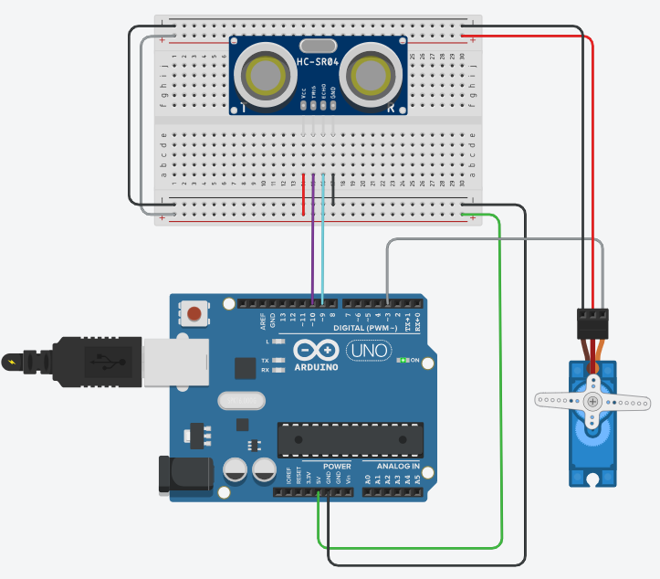

### LANGKAH 1 
buka website https://www.tinkercad.com/

### LANGKAH 2
logim menggunakan akun google masing - masing

### LANGKAH 3 
klik CREATE

### ULTRASONIC

| PIN ARDUINO | PIN ULTRASONIC  |
| ------ | ------ |
| 10|   TRIG|
|9 | ECHO|
|VCC|+  5v|
|GND|- GND|
### SERVO
| PIN ARDUINO | PIN SERVO  |
| ------ | ------ |
|3 | SIGNAL|
|+ 5v|POWER|
|GND|- GND|

